<p align="center"><a href="https://laravel.com" target="_blank"></a></p>

# File reader powerd by ( Ahmed abd el salam )

####  You can read almost any file except Microsoft family files.
######## but make sure the file has read permission.
## Install the dependencies

```bash
composer install
```

### you can run the project

```bash
php artisan serve
```

### Lint of routes
###### All routes under API
- **your-domain.com/api/login**
- **your-domain.com/api/get-file**


### After installing dependencies you can login with

```bash
Username : admin
Password : admin
```
